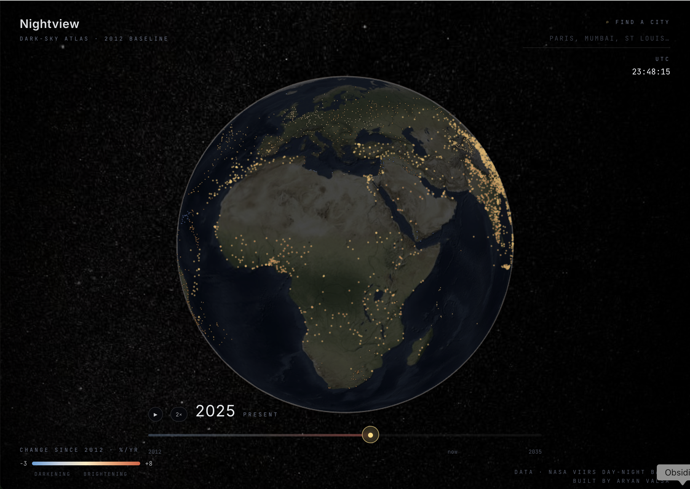

# Nightview

> An interactive 3D globe of how the night sky has changed across Earth since 2012, with a conversational AI agent that drives the camera and surfaces patterns in real NASA VIIRS satellite measurements.



**[Live demo](https://nightview.aryanvalsa.me)** · [Methodology](#methodology) · [Source](https://github.com/CoolKingGreat/nightview)

---

## What it does

- **A globe painted with real measurements.** 2,933 cities and dark-sky destinations, every one of them backed by per-pixel NASA VIIRS Day/Night Band radiance pulled from Google Earth Engine. Trend rate colors the dots (blue → cream → red, darkening through brightening), population sizes them. NASA's Black Marble nighttime imagery is the basemap, so continental geography reads naturally underneath.
- **A time scrubber across the bottom.** Drag between 2012 and 2035; the dots morph in real time as each city's measured trend extrapolates forward. Play button auto-animates the 23-year arc.
- **A conversational agent.** Claude Haiku 4.5 (with prompt caching for ~95% cache-hit rate after the first turn), escalating to Sonnet 4.6 on comparative queries. Ask *"where is the night sky disappearing fastest?"*, *"compare India vs China"*, *"what can I see from Houston tonight?"*, *"is the Milky Way visible from Cherry Springs?"* — the relevant cities pulse in their existing heatmap colors, the camera glides to frame them, and the agent narrates in warm prose with the actual numbers cited.
- **Click any city or dark-sky park** for an Inspector with the measured monthly brightness time series, the Prophet forecast through 2035, current Bortle class, naked-eye limiting magnitude, what's actually visible at that sky quality (Milky Way state, named DSOs, approximate star count), tracked milestones (*"brightness doubled · 2017"*), and the nearest dark-sky escape (with km distance).
- **Search any place** from the top-right autocomplete. The 51 IDA-certified dark-sky parks are all in the dataset, clickable, and rendered as proper measured rows.

## Architecture

```
                  ┌──────────────────────────────────────┐
                  │   React + Vite + CesiumJS frontend   │
                  │   Black Marble basemap +             │
                  │   chat orb + inspector + scrubber    │
                  │   + city search + methodology modal  │
                  └─────────────┬────────────────────────┘
                                │  HTTP / SSE
                  ┌─────────────▼────────────────────────┐
                  │           FastAPI backend            │
                  │  ┌──────────────────────────────┐    │
                  │  │  Claude agent loop           │    │
                  │  │  Haiku 4.5 (prompt-cached)   │    │
                  │  │  → Sonnet 4.6 on complex     │    │
                  │  └──────────────┬───────────────┘    │
                  │                 │                    │
                  │  ┌──────────────▼───────────────┐    │
                  │  │  6 tools                     │    │
                  │  │  · query_region              │    │
                  │  │  · point_timeseries          │    │
                  │  │  · top_changers              │    │
                  │  │  · milestones_in_region      │    │
                  │  │  · compare_regions           │    │
                  │  │  · dark_sky_locations        │    │
                  │  └──────────────┬───────────────┘    │
                  │                 │                    │
                  │  ┌──────────────▼───────────────┐    │
                  │  │  Rate limit + daily $ cap    │    │
                  │  └──────────────────────────────┘    │
                  └─────────────────┬────────────────────┘
                                    │
                  ┌─────────────────▼────────────────────┐
                  │       Parquet trends store           │
                  │  per-city: measured radiance + SQM,  │
                  │  trend %/yr, Bortle, NELM, visibility│
                  │  notes, 156-month history,           │
                  │  120-month Prophet forecast,         │
                  │  milestone years, nearest dark sky   │
                  └─────────────────┬────────────────────┘
                                    │   offline ingestion
                  ┌─────────────────▼────────────────────┐
                  │   scripts/                           │
                  │  · ingest_seed.py     curated seed   │
                  │  · ingest_global.py   geonames bulk  │
                  │  · ingest_gee.py      real GEE pixels│
                  │                       (the live one) │
                  └──────────────────────────────────────┘
```

## Quick start

```bash
make install        # one-time: backend venv + npm install
make dev            # starts backend on :8000 and frontend on :5173
# open http://localhost:5173
```

You'll need:

- Python 3.11+
- Node 20+
- An [Anthropic API key](https://console.anthropic.com) in `.env` at the repo root:
  ```
  ANTHROPIC_API_KEY=sk-ant-...
  ```
- A [Cesium Ion token](https://ion.cesium.com/tokens) for the NASA Black Marble basemap (free tier covers it). Add to `.env`:
  ```
  VITE_CESIUM_ION_TOKEN=eyJhbGciOi...
  ```
  The Black Marble basemap is on by default in `frontend/src/components/Globe.tsx` (`USE_BLACK_MARBLE_BASEMAP = true`). Without a token, the globe falls back to Cesium's bundled Natural Earth II imagery.

To regenerate the dataset yourself (requires a free [Google Earth Engine](https://earthengine.google.com/signup/) account, ~2 hours of GEE compute for the full 2,933 cities):

```bash
earthengine authenticate
GEE_PROJECT_ID=your-gcp-project make seed-global
backend/.venv/bin/python scripts/ingest_gee.py --project your-gcp-project
```

Other targets:

```bash
make help           # list available targets
make stop           # kill backend + frontend
make seed           # regenerate from curated seed only (~150 cities)
make seed-global    # regenerate via geonamescache + seed overlay
make typecheck      # tsc + py_compile across both halves
```

## Stack

| Layer       | Choice                                                                                                          |
| ----------- | --------------------------------------------------------------------------------------------------------------- |
| Globe       | CesiumJS with NASA Black Marble basemap via Cesium Ion; `PointPrimitiveCollection` for GPU-direct dot rendering |
| UI          | React 18 + Vite + TypeScript + TailwindCSS + Motion (`motion/react`)                                            |
| Backend     | FastAPI + Anthropic Python SDK (streaming tool-use, prompt caching)                                             |
| LLM         | Claude **Haiku 4.5** default, escalates to **Sonnet 4.6** on comparative queries                                |
| Data source | NASA VIIRS Day/Night Band (VNP46A2), pulled per-pixel via Google Earth Engine                                   |
| Storage     | Parquet, queried via pandas (single file, ~7 MB)                                                                |
| Forecast    | Per-city Prophet with yearly seasonality, linear growth, 120-month horizon                                      |
| Frontend    | Vercel                                                                                                          |
| Backend     | Oracle Cloud Always-Free (A1 Flex ARM), Docker + systemd + Caddy + Let's Encrypt                                |

Monthly cost: $0. Domain renewal is the only ongoing fee.

## Methodology

For the in-depth version, click the **methodology** link in the bottom-right of the live site. The short version:

**Source.** Every city's radiance comes from NASA's VIIRS DNB monthly composite (VNP46A2 Black Marble), sampled as the median radiance over a 10 km buffer around the centroid, filtered to good-quality pixels (cloud-and-lunar-and-snow-masked) via the product's own `Mandatory_Quality_Flag`. Aggregation runs server-side on Google Earth Engine in one call per city. The record runs April 2012 through April 2025 (~156 months).

**SQM (sky brightness in mag/arcsec²)** is derived from radiance using the Falchi et al. (2016) calibration:
```
SQM = 22.0 − 2.5 · log₁₀(radiance / 0.171 + 1)
```
where 22.0 is the pristine-sky reference and 0.171 nW/cm²/sr is the natural-night baseline (airglow + zodiacal).

**Bortle class (1-9)** uses John Bortle's original 2001 thresholds. Class 1 is pristine dark-sky (SQM ≥ 21.99); Class 9 is inner-city (SQM < 17.80).

**Naked-eye limiting magnitude** interpolates between Crumey (2014) reference points.

**"What you can see"** maps Bortle class to typical naked-eye star counts and named visible objects (Milky Way state, M31, M42, M45, zodiacal light) per Bortle's original article and amateur-astronomy convention.

**Forecasts** run 120 months ahead via Prophet with yearly seasonality and linear growth.

**Honest limits.** The 10 km buffer averages in a lot of water for coastal cities (San Francisco, Hong Kong, Sydney all read artificially low). VIIRS has a noise floor near the dark end, so even the most pristine sites cap around SQM 21.9. Forecasts assume the past 13 years of trend continue; cities mid-LED-conversion (Chicago is the canonical case) may flatten or reverse in ways Prophet can't anticipate.

## Project layout

```
.
├── backend/                FastAPI + Anthropic SDK
│   ├── app/
│   │   ├── main.py         endpoints (/api/chat, /api/cities, /api/point, /api/top_changers, /api/health)
│   │   ├── agent.py        Claude tool-use loop, model routing, error handling
│   │   ├── tools.py        6 tool JSON schemas + async dispatcher
│   │   ├── data.py         Parquet → pandas, SQM/Bortle/NELM helpers, dark-sky lookup
│   │   ├── schemas.py      Pydantic models (PlaceResult, TimeSeriesResult, SkyVisibility, DarkSkyPlace, …)
│   │   └── rate_limit.py   per-IP + daily $ cap
│   └── requirements.txt
├── frontend/               React + Vite + Cesium
│   └── src/
│       ├── components/     Globe · ChatOrb · Inspector · CitySearch · HoverTooltip · TimeRibbon · ObservatoryHud · Methodology · Welcome · ErrorBoundary
│       ├── lib/            api, types, prompts
│       ├── App.tsx · main.tsx · index.css
│       └── ...
├── scripts/                ingestion pipelines (seed, global, gee)
├── data/
│   ├── raw/                cities_seed.csv (curated cities + 51 IDA dark-sky places) · dark_sky_places.csv
│   └── processed/          trends.parquet (~7 MB, generated by ingest_gee.py)
├── Dockerfile              backend image (Caddy + systemd-managed on Oracle)
├── Makefile                make install / dev / stop / seed / seed-global / typecheck
└── README.md
```

## Credits

- **NASA Earth Observatory** — VIIRS Day/Night Band imagery and the Black Marble (VNP46A2) product family
- **Google Earth Engine** — the public catalog and compute that makes per-pixel sampling at this scale free for noncommercial use
- **Christopher C. M. Kyba** et al. (2017) — *Artificially lit surface of Earth at night increasing in radiance and extent*
- **Alejandro Sánchez de Miguel** et al. (2021) — global trends in nocturnal power emissions
- **Fabio Falchi** et al. (2016) — *World Atlas of Artificial Night Sky Brightness* (the VIIRS → SQM calibration)
- **John Bortle** (2001) — *Introducing the Bortle Dark-Sky Scale* in Sky & Telescope
- **Andrew Crumey** (2014) — naked-eye limiting magnitude reference table
- **International Dark-Sky Association** — the certified dark-sky places list
- [**geonamescache**](https://github.com/yaph/geonamescache) — bundled global cities database used to seed the long tail
- **Cesium / Cesium Ion** — globe rendering + Black Marble basemap hosting
- **Anthropic** — Claude API
